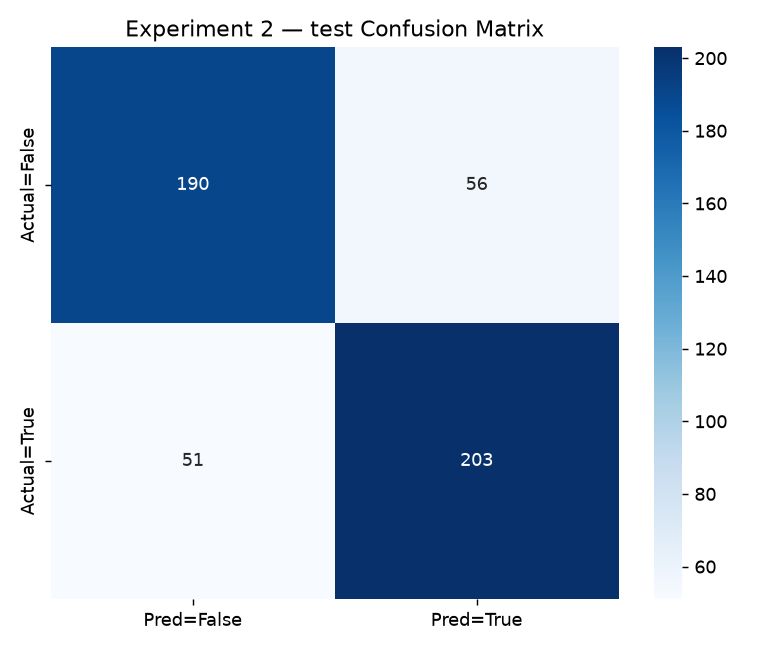
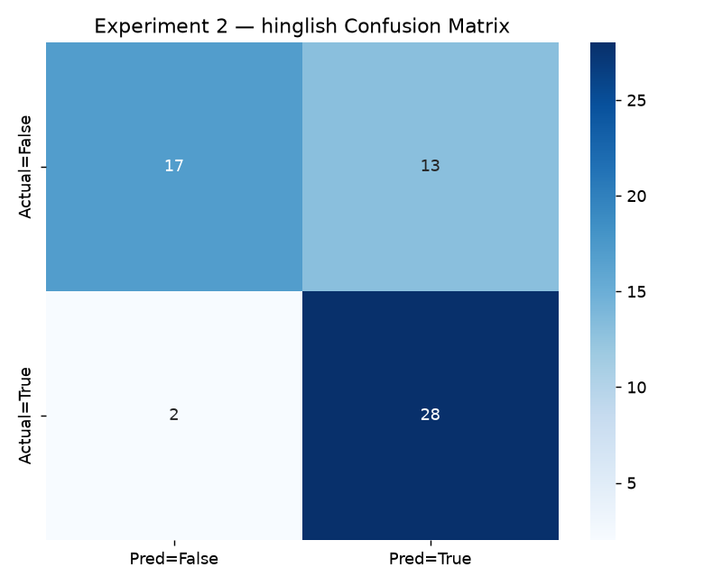
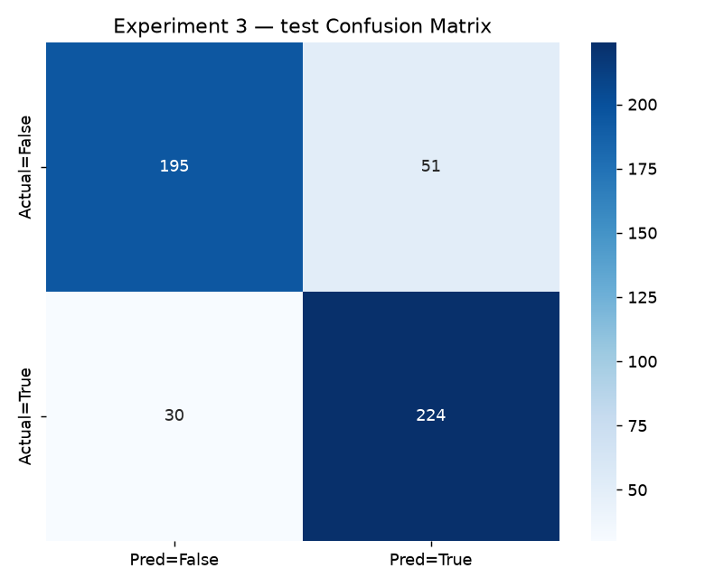
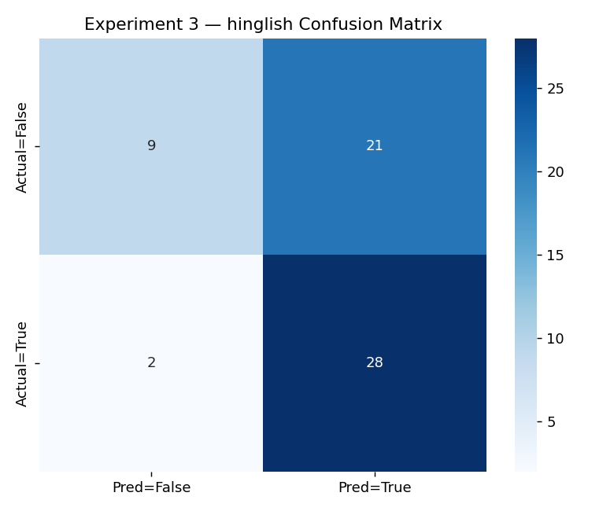
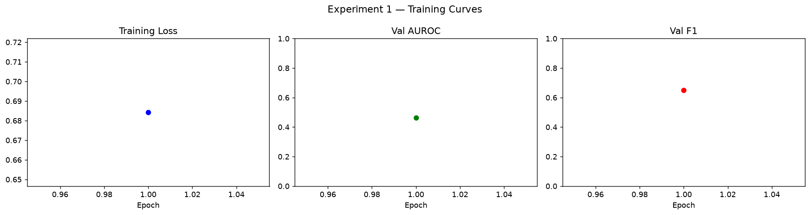
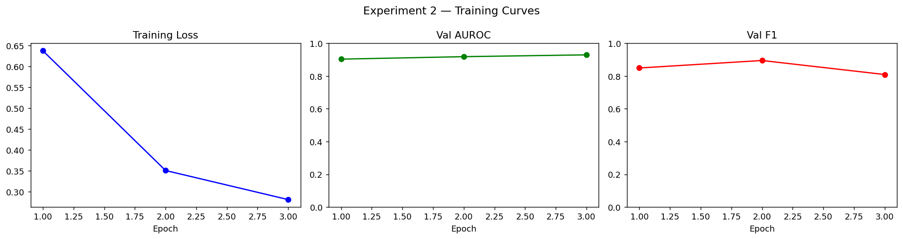
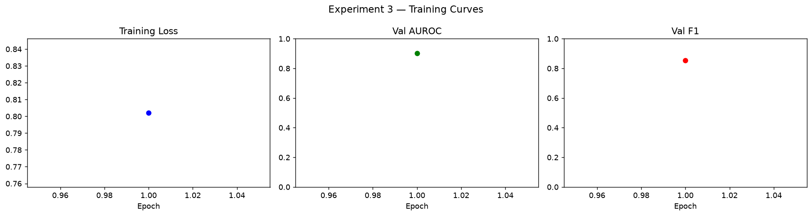

# Hinglish Turn Detection

Audio-only turn endpoint detection — Shiprocket Data Scientist Challenge

A compact, fast model that listens to the trailing two seconds of a speaker's audio and answers one question: has the speaker finished their turn, or are they pausing mid-thought?

---

## Headline Results

| Experiment | Configuration | Val AUROC | Test AUROC | Test F1 | Hinglish AUROC | CPU Latency |
|------------|---------------|-----------|------------|---------|----------------|-------------|
| Exp 1 | Baseline — frozen Whisper + mean pool | 0.464 | — | — | — | — |
| Exp 2 | + Attention pooling, top-2 blocks unfrozen | 0.930 | **0.861** | **0.791** | **0.782** | **207 ms / RTF 0.103** |
| Exp 3 | + Hard-negative 3x oversampling | 0.901 | 0.911 | 0.863 | 0.720 | 508 ms / RTF 0.254 |

Experiment 2 is the recommended checkpoint — best Hinglish generalisation, fastest inference.

---

## Architecture

```
Waveform (16 kHz PCM)
  -> WhisperFeatureExtractor  [frozen]  -> log-mel spectrogram (80-dim, 3000 frames)
  -> Whisper Tiny Encoder
       Blocks 0-1: frozen    (low-level acoustic features)
       Blocks 2-3: fine-tuned (high-level temporal patterns)
  -> AttentionPooling         [learned 384-dim query, softmax over time axis]
  -> MLP Head                 Linear(384->128) -> GELU -> Dropout(0.15) -> Linear(128->1)
  -> sigmoid -> P(turn_end)
```

- 8.26M total parameters; 3.6M trainable in Exp 2 and 3 (43.6%)
- Exported to ONNX (36 KB); runs at RTF 0.103 on a single CPU thread
- No ASR, no transcript — pure acoustics only

---

## The Hinglish Problem

The training dataset tags 721 rows as `hin`, but all are synthetic TTS from a single voice model — monolingual Hindi, not code-switched Hinglish. To surface this gap honestly, we built a separate 60-clip synthetic Hinglish evaluation set (30 turn-end, 30 mid-turn) using gTTS with code-switched sentences.

| Set | AUROC | F1 |
|-----|-------|----|
| Main test (in-distribution) | 0.861 | 0.791 |
| Hinglish held-out (OOD proxy) | 0.782 | 0.789 |
| Gap | -0.079 | -0.003 |

See [HINGLISH_EVAL.md](HINGLISH_EVAL.md) for full construction details and limitations.

---

## Results at a Glance

### Confusion Matrices

| Exp 2 — Main Test Set | Exp 2 — Hinglish Held-Out |
|:---------------------:|:-------------------------:|
|  |  |

| Exp 3 — Main Test Set | Exp 3 — Hinglish Held-Out |
|:---------------------:|:-------------------------:|
|  |  |

### Training Curves

| Exp 1 | Exp 2 | Exp 3 |
|:-----:|:-----:|:-----:|
|  |  |  |

---

## Key Findings

1. **Attention pooling is the decisive change.** Exp 1 to Exp 2 moves AUROC from 0.464 to 0.930 on validation — from a single architectural change in the pooling layer, not the encoder. Concentrating on prosodically salient frames at the turn boundary matters far more than uniformly averaging all frames.

2. **The model partially learns TTS voice characteristics.** The `midcentury_1` source (real human speech) scores AUROC 0.460 on the main test set — near random. Not production-ready without more real-speech training data.

3. **Hard-negative oversampling improves main test performance but hurts Hinglish.** Exp 3 raises test AUROC to 0.911 but drops Hinglish AUROC to 0.720. The bias-variance tradeoff does not favour Exp 3 for the target use case.

4. **ONNX at 207 ms, RTF 0.103.** The exported model fits within any reasonable voice assistant latency budget, running at 10% of real-time on a single CPU thread.

---

## Quickstart

```bash
# 1. Install
pip install -r requirements.txt

# Or use Make:
make setup
```

```bash
# 2. Build the synthetic Hinglish eval set (~5 min, internet required)
make hinglish

# 3. Build train/val/test splits (streams from HuggingFace)
make splits

# 4. Train all experiments
make train1 train2 train3

# 5. Evaluate Experiment 2 + ONNX export
make eval2

# 6. Interactive Gradio demo
make demo
```

Or run the full pipeline in one go:

```bash
make all   # setup + hinglish + splits + train2 + eval2
```

---

## Repository Structure

```
hinglish-turn-detector/
|
|- model.py                    # WhisperTinyTurnDetector + AttentionPooling
|- data_prep.py                # EDA analysis and split builder
|- train.py                    # Training loop (Experiments 1, 2, 3)
|- eval.py                     # Test eval + Hinglish eval + ONNX benchmark
|- hinglish_eval_builder.py    # Synthetic Hinglish eval set via gTTS
|- app.py                      # Gradio interactive demo
|- Makefile                    # One-command workflow targets
|- run_pipeline.sh             # End-to-end shell pipeline
|- requirements.txt
|- REPORT.md                   # Full analysis and findings
|- HINGLISH_EVAL.md            # Hinglish eval set construction and limitations
|
|- notebooks/
|   |- analysis.ipynb          # Visual walkthrough (EDA, results, error analysis)
|
|- stats/
|   |- data_analysis.json
|   |- exp{1,2,3}_results.json
|   |- exp{2,3}_full_eval.json
|   |- exp{2,3}_errors.json
|   |- plots/
|       |- eda_summary.png
|       |- exp{1,2,3}_curves.png
|       |- exp{2,3}_test_cm.png
|       |- exp{2,3}_hinglish_cm.png
|
|- onnx/
|   |- exp2_model.onnx         # Best checkpoint (recommended)
|   |- exp3_model.onnx
|
|- hinglish_eval/
|   |- metadata.csv            # 60 Hinglish clips with labels and text
|   |- metadata.json
|   |- *.wav                   # gitignored — regenerate with make hinglish
```

---

## Reproducibility

All random seeds fixed at 42. Training used ~2,000 rows on CPU; full-scale GPU training on 220k rows expected to substantially close the remaining gaps. Pre-computed stats, plots, and ONNX models are committed so results are reviewable without re-running training.
